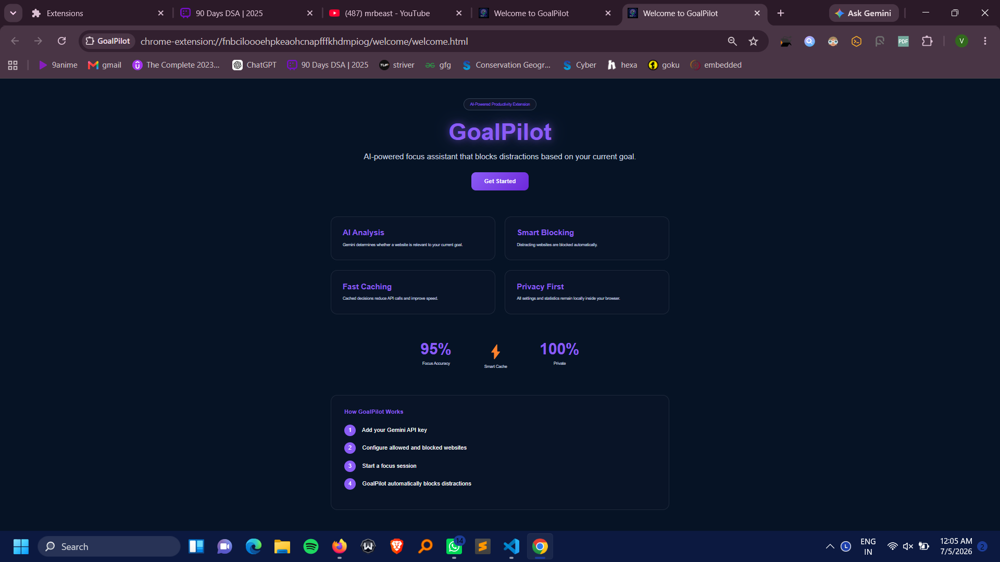
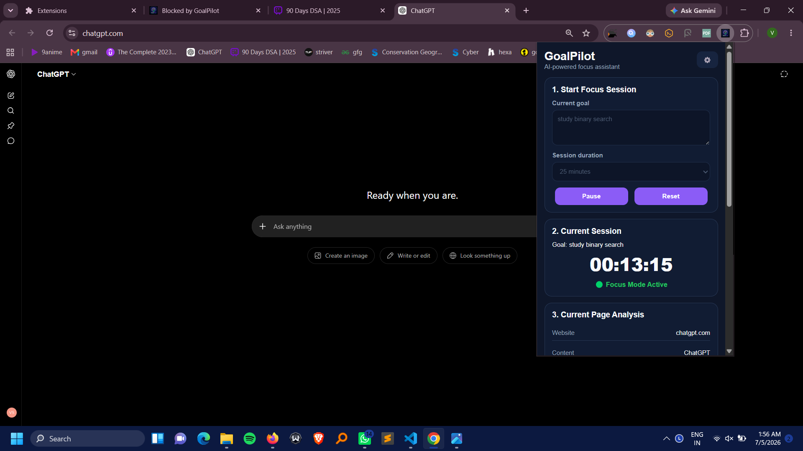
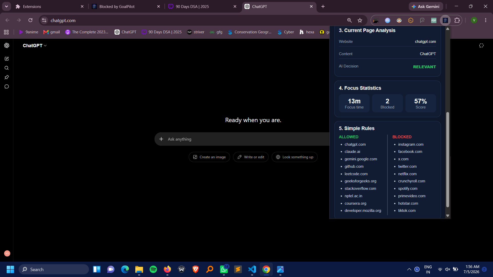
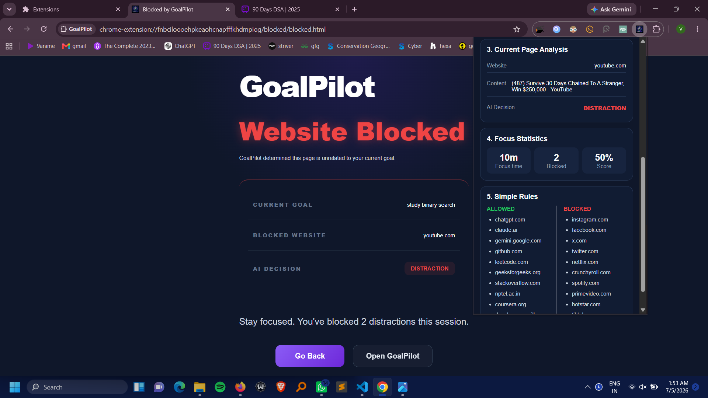
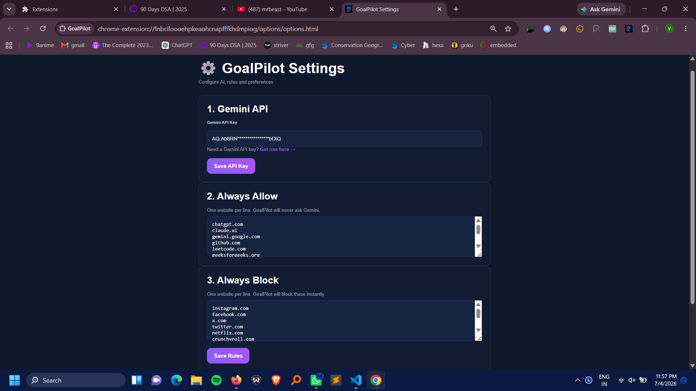

# 🚀 GoalPilot – AI-Powered Productivity Chrome Extension

GoalPilot is an AI-powered Chrome extension that helps users stay focused by automatically identifying and blocking distracting websites and content based on their current study or work goal.

Using Google's Gemini API, GoalPilot analyzes visited websites in real-time and determines whether the content is relevant to the user's current objective.

---

## ✨ Features

### 🎯 Goal-Based Focus Sessions

- Create custom study or work goals.
- Set focus session duration.
- Start, pause, and reset focus sessions.

### 🤖 AI-Powered Website Analysis

- Uses Google's Gemini API to determine whether a website helps achieve the user's goal.
- Analyzes website URLs and page titles in real-time.
- Supports any type of goal (programming, exams, fitness, work, learning, etc.).

### 🚫 Smart Distraction Blocking

- Automatically blocks distracting websites.
- Displays a custom distraction page explaining why the content was blocked.
- Provides one-click return to productive work.

### ⚡ Decision Caching

- Caches previous AI decisions.
- Reduces API calls.
- Improves extension performance.

### 📊 Productivity Analytics

- Tracks:
  - Focus time
  - Number of blocked distractions
  - Focus score
- Displays live productivity statistics.

### 🔒 Custom Rules

- Configure:
  - Always Allow websites
  - Always Block websites
- Override AI decisions when needed.

### 🔐 API Key Validation

- Verifies Gemini API keys before saving.
- Prevents invalid API configurations.

### 👋 Welcome Experience

- Dedicated onboarding page.
- Explains how GoalPilot works.
- Guides users through setup.

---

# 🛠️ Tech Stack

- JavaScript
- HTML5
- CSS3
- Chrome Extension Manifest V3
- Chrome Storage API
- Chrome Tabs API
- Google Gemini API

---

# 📂 Project Structure

```text
goalpilot-ai/

├── popup/
│   ├── popup.html
│   ├── popup.css
│   └── popup.js
│
├── blocked/
│   ├── blocked.html
│   ├── blocked.css
│   └── blocked.js
│
├── options/
│   ├── options.html
│   ├── options.css
│   └── options.js
│
├── welcome/
│   ├── welcome.html
│   ├── welcome.css
│   └── welcome.js
│
├── icons/
│   ├── icon16.png
│   ├── icon48.png
│   └── icon128.png
│
├── screenshots/
│
├── background.js
├── blocker.js
├── rules.js
├── gemini.js
├── content.js
├── manifest.json
└── README.md
```

---

# 📸 Screenshots

## Welcome Page



---

## Focus Session Dashboard



---

## AI Page Analysis



---

## Blocked Website



---

## Settings Page



---

# ⚙️ Installation

### 1. Clone the repository

```bash
git clone https://github.com/vnssn/goalpilot-ai.git
```

### 2. Open Chrome Extensions

Navigate to:

```text
chrome://extensions
```

### 3. Enable Developer Mode

Turn on **Developer Mode** in the top-right corner.

### 4. Load Extension

Click:

```
Load unpacked
```

Select the project folder.

---

# 🚀 Getting Started

### Step 1

Get a Gemini API key from:

https://aistudio.google.com/apikey

### Step 2

Open GoalPilot Settings.

### Step 3

Add your Gemini API key.

### Step 4

Configure allowed and blocked websites.

### Step 5

Start a focus session.

### Step 6

GoalPilot will automatically analyze websites and block distractions.

---

# 🧠 How GoalPilot Works

```
User sets goal
        ↓
User opens website
        ↓
GoalPilot captures URL + title
        ↓
Checks custom rules
        ↓
Checks local cache
        ↓
Sends request to Gemini
        ↓
Gemini returns:
RELEVANT
or
DISTRACTION
        ↓
GoalPilot allows or blocks website
```

---

# 📈 Features Implemented

- [x] Goal-based focus sessions
- [x] Gemini API integration
- [x] Website classification
- [x] Distraction blocking
- [x] Blocked page
- [x] Session timer
- [x] Focus statistics
- [x] Focus score
- [x] Website caching
- [x] API validation
- [x] Welcome page
- [x] Settings page
- [x] Custom rules
- [x] Real-time page analysis

---

# 🔮 Future Improvements

- Chrome Web Store publishing
- Weekly productivity reports
- Session history export
- Pomodoro mode
- Productivity graphs
- Multiple goal profiles

---

# 👨‍💻 Author

**Vansh Singh**

B.Tech Electronics & Communication Engineering  
Netaji Subhas University of Technology (NSUT)

---

# ⭐ If you found this project interesting, consider giving it a star.
